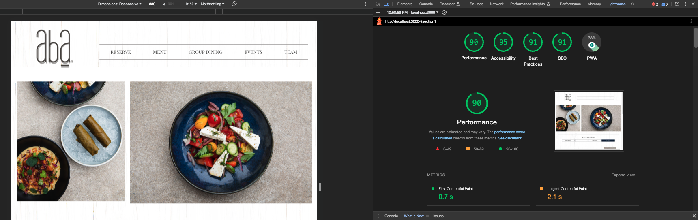
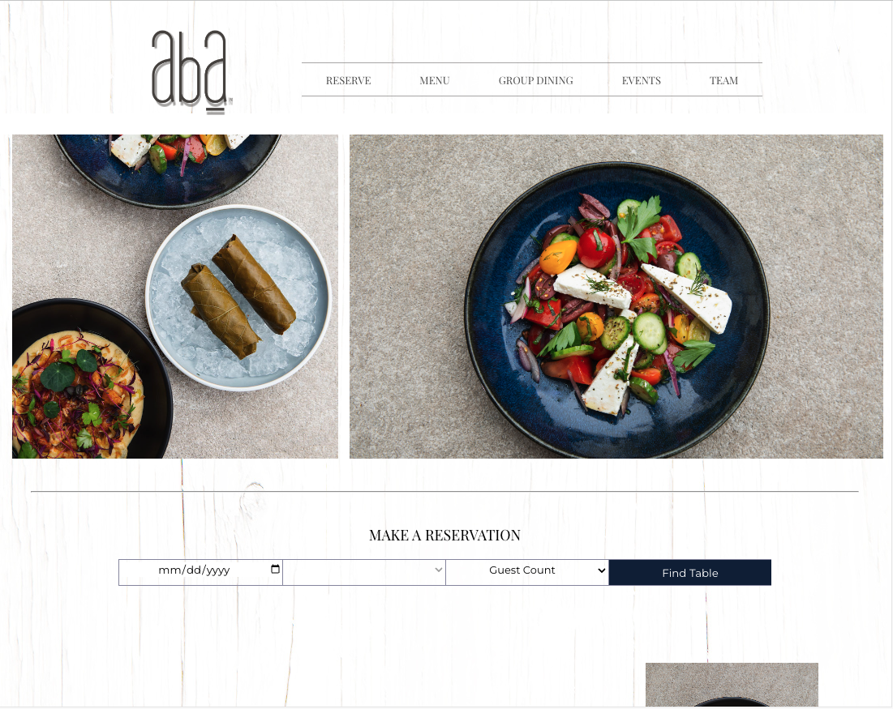

# Getting Started with Create React App

 

  

## Overview

This project is a recreation of a generic template using HTML, CSS, React and JavaScript. The goal is to replicate the provided design by Lettuce Entertain You as closely as possible, while ensuring responsiveness, accessibility, and clean code.

## Project Details

- **ADA Compliance**: The project has been audited for ADA compliance, ensuring it meets AA WCAG compliance standards. Automated checkers like Google Lighthouse have been used for validation. Additionally, keyboard and screen reader users have been considered for accessibility.
- **Responsive Design**: The website is responsive across multiple devices, including mobile, tablet, and desktop. While the design provided is for desktop, adjustments have been made for mobile and tablet views as well.
- **Cross-Browser Compatibility**: The website has been tested and validated to function and appear identically across the newest browser versions, ensuring a consistent user experience.
- **Clean and DRY Code**: The codebase adheres to best practices for clean and maintainable code. The console has no errors, variables, functions, classes, etc., follow clear and consistent naming conventions. HTML5 semantic elements are used where appropriate, ensuring code quality.
- **Reservation Form**: The reservation form follows proper semantic form structure. Users are required to input date, time, and the number of people. Once submitted, the form is hidden, and a second form requesting customer information (Name, Phone Number, Email) is displayed. After validation and submission, the second form is replaced by a success message. No information is stored or submitted anywhere for this exercise.
- **Navigation and Footer Links**: While links are present in the navigation and footer, they do not link to live pages as this exercise focuses on design and functionality.

## 🚀 About Me

- With four years of teaching experience and a Full Stack Development Program under my belt, I bring dedication, a thirst for learning, and a knack for picking up new skills with enthusiasm.
- I've called many places home throughout my life, but Chicago holds a special place in my heart. It's a city like no other, where you can relish an extensive range of delectable cuisines at affordable prices, all while basking in the warm and welcoming charm that's preserved whether you're savoring treats from local gems like Margie's or established favorites like Stan's Donuts.
- While creating this project I genuinely loved the whole process and had so much fun completing this challenge. I also learned a few new things along the way, and that is my favorite part about development. You are always going to learn something new.
- https://kristina-song-portfolio.onrender.com/index.html

## Acknowledgements

- [Awesome Readme Templates](https://awesomeopensource.com/project/elangosundar/awesome-README-templates)
- [Awesome README](https://github.com/matiassingers/awesome-readme)
- [How to write a Good readme](https://bulldogjob.com/news/449-how-to-write-a-good-readme-for-your-github-project)
- [This project was bootstrapped with Create React App](https://github.com/facebook/create-react-app)

## Authors

- [@knsong1](https://github.com/knsong1/AbaCodingChallenge)

## Optimizations

Throughout the development of my project for Lettuce Entertain You, I placed a strong emphasis on optimizing various aspects to ensure an efficient, accessible, and maintainable website. Here are some key optimizations I've implemented:

## CSS Efficiency:

I made sure that my CSS files are concise and optimized to minimize repetition. By using efficient selectors and avoiding redundant rules, I improved the overall styling of the website while keeping the codebase clean and maintainable.

- **Responsive Design:** Recognizing the importance of a seamless user experience across all devices, I incorporated responsive design principles into the project. The website adapts effortlessly to mobile, tablet, and desktop screens thanks to CSS media queries.
- **Accessibility Focus:** Accessibility is a top priority. I integrated ARIA roles and attributes, ensuring that users with disabilities can navigate the site with ease. I also subjected the project to automated accessibility checkers, such as Google Lighthouse, to guarantee ADA compliance.
- **Clean and Maintainable Code:** Clean code is essential for long-term maintainability. I followed the DRY (Don't Repeat Yourself) principle and maintained clear and consistent naming conventions. The codebase is well-organized, and I eliminated any logic redundancy.
- **Component-Based Architecture:** I structured my React project using a component-based architecture. This approach enables me to create reusable components, reducing code redundancy and streamlining development. Complex features are broken down into manageable, reusable components.
- **Efficient Image Handling:** To enhance page loading speed and the user experience, I adopted the `<picture>` element for image delivery. This element ensures that images are served efficiently based on the user's device and network conditions.
- **Code Reusability:** In pursuit of code reusability, I created custom components and utility functions. These components and functions can be easily reused across the project, saving development time and promoting maintainability.

By optimizing these aspects of the project, I aimed to deliver a high-quality website that excels in performance, accessibility, and code maintainability. These optimizations not only improve the user experience but also facilitate future development and collaboration.

## Demo

## Color Reference

| Color         | Hex             |
| ------------- | --------------- |
| Example Color | #aaadb2         |
| Example Color | #10213e         |
| Example Color | #10213e         |
| Example Color | rgba(0,0,0,0.2) |

## Screenshots

## `npm start`

Runs the app in the development mode.
Open [http://localhost:3000](http://localhost:3000) to view it in your browser.

The page will reload when you make changes.
You may also see any lint errors in the console.

### Clone this repository to your local machine:

- _gh repo clone knsong1/AbaCodingChallenge_
